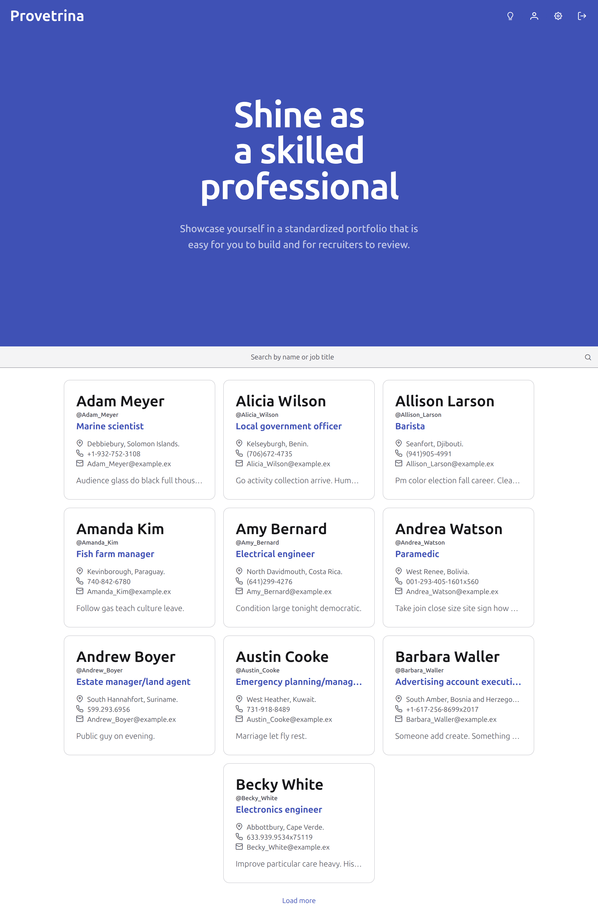
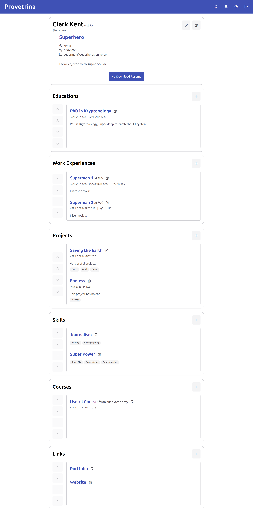

# Provetrina

Shine as a skilled professional by showcasing yourself in a standardized portfolio that is easy for you to build and for recruiters to review.

**Provetrina** is a professional talent directory and portfolio builder designed to bridge the gap between talented individuals and potential opportunities. Built as the final project for **CS50’s Introduction to Web Programming with Python and JavaScript**, it allows users to create, manage, and share comprehensive professional profiles.

---

---

---

---

## Distinctiveness and Complexity

Provetrina is a significant departure from standard CS50W projects in both architecture and functionality. While previous course projects (like Network or Commerce) primarily utilized a monolithic Django structure, Provetrina is built as a modern, decoupled Single Page Application (SPA) with advanced features and comprehensive testing suite.

- **Architectural Complexity**:
  The project separates the **Django REST Framework (DRF)** backend from an **Angular** frontend. This separation required implementing complex **cross-origin resource sharing** (CORS), **token-based authentication**, and a robust API design that differs fundamentally from the server-side rendering taught in the course.
- **Distinctive Features**:
  - **Dynamic PDF Generation**: The project uses the `fpdf` library in a dedicated `resume.py` module to dynamically **generate professional PDF resumes** based on the user's latest data.
  - **Modular Component Architecture**: The frontend is organized by feature, utilizing **Angular’s signals**, standalone components, and **sophisticated state management** (via list-store.ts).
  - **Advanced Data Operations**: Users can **reorder**, **add**, and **delete** entries within multiple profile sections (Education, Work, Projects, etc.), requiring complex frontend-to-backend synchronization.
  - **Privacy Controls**: Users can toggle their profile between **public and private**. This affects searchability in the talent directory and governs **access permissions** for viewing profiles and downloading resumes.
  - **Talent Directory**: A home page that displays a simple hero and **searchable profile list** to facilitate profiles discovery.
- **Technical Depth**:
  - **Database Management**: A custom Python script, `pg.py`, manages a **PostgreSQL** database via **Docker Compose**, automating the `up`, `down`, and `reset` commands for the development environment.
  - **Automated Testing**: The project includes a full testing suite. The backend is tested via Django's `tests.py` in both the accounts and profiles apps. The frontend is tested using **Vitest** and the **Angular Testing Library**, organized by feature.
  - **Seeding**: A Django management command `seed.py` uses the **Faker** library to populate the database with realistic dummy data for development.

---

## File Structure and Descriptions

### Backend (`/backend`)

- `manage.py`: Django's command-line utility for administrative tasks.
- `pg.py`: A utility script to manage the PostgreSQL Docker container.
- `compose.yml`: Docker configuration for the database service.
- `requirements.txt`: Lists all Python dependencies (Django, djangorestframework, fpdf, faker, etc.).
- **provetrina/accounts/**:
  - `models.py`: Custom user model and account data.
  - `serializers.py`: DRF serializers for user and authentication data.
  - `views.py`: API views for registration, login, and account management.
  - `tests.py`: Unit tests for authentication logic.
- **provetrina/profiles/**:
  - `models.py`: Relational models for profiles and their various sections (Education, Work, etc.).
  - `resume.py`: Logic for generating the dynamic PDF resume.
  - `views.py` & `serializers.py`: Logic for the talent directory and profile management API.
  - `management/commands/seed.py`: Custom script to seed the database with dummy data.
  - `tests.py`: Unit tests for profile and permission logic.

### Frontend (`/frontend`)

- `package.json`: Manages Node.js dependencies and scripts.
- **src/app/accounts/**: Components and services for authentication (sign-in, sign-up) and account settings. Includes `auth-interceptor.ts` for attaching tokens to requests.
- **src/app/profiles/**:
  - `profile/`: Component for viewing a professional profile.
  - `profile-form/` & `section-form/`: Dynamic forms for creating/editing profile data.
  - `create-profile/`: The initial setup form for new users.
  - `profiles.ts`: Service for interacting with the profiles API.
- **src/app/list/**: Implements a dynamic searchable list of data, including `list-store.ts` for state management.
- **src/app/navigation/**: Navigation indications (loaders, errors, etc).
- **src/app/utils/**: Shared utility functions.
- `*.spec.ts`: Test files for individual components and services using Vitest and Angular Testing Library.

---

## How to Run the Application

### Prerequisites

- **Python** v3.14
- **Docker** v29.4 for running the **PostgreSQL** database locally
- **Node.js** v22.22, **NPM** v11.13, and global installation of the **@angular/cli** v21.2

### Backend Setup

1. Navigate to the `backend` directory.
2. Optionally, activate a Python virtual environment `venv`.
3. Install dependencies: `pip install -r requirements.txt`.
4. Create a `.env` file based on the `.env.sample`.
5. Start the database: `python3 pg.py up`.
6. Run migrations: `python3 manage.py migrate`.
7. Optionally, seed the database: `python3 manage.py seed`.
8. Start the server: `python3 manage.py runserver`.

### Frontend Setup

1. Navigate to the `frontend` directory.
2. Install dependencies: `npm install`.
3. Start the dev server: `npm start`.
4. Open your browser to `http://localhost:4200`.

### Testing

Run backend tests with `python3 manage.py test` and frontend tests with `npm test`.

---

## Additional Information

- **User Flow**: Authenticated users start with an account page; upon visiting their profile page for the first time, they are prompted to create a profile. Once created, they can manage multiple entries across five distinct professional sections.
- **Mobile Responsiveness**: The UI is designed to be fully responsive across all device sizes.
